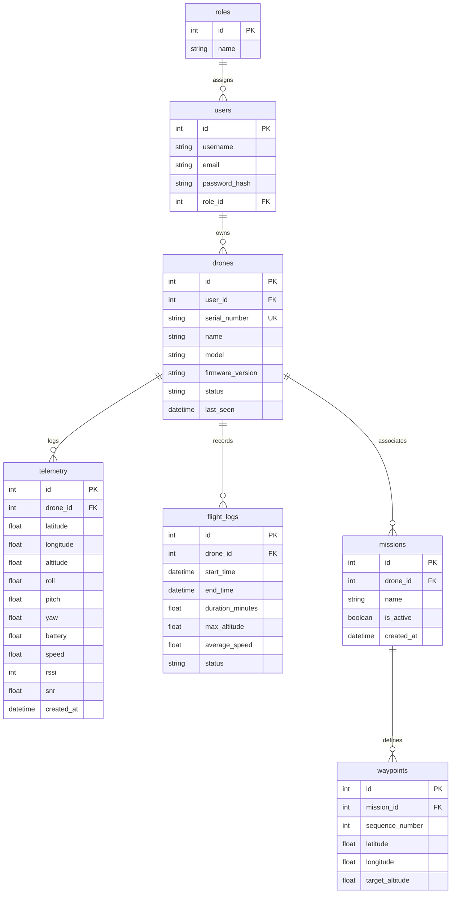

# Database Design - Aero-Link GCS

Aero-Link menggunakan database relasional untuk menyimpan konfigurasi operator, profil drone prototype, histori telemetri penerbangan, rencana misi, serta log riwayat penerbangan.

## 1. Entity Relationship Diagram (ERD)

---

## 2. Struktur Tabel & Skema Kolom

### 2.1. Tabel `roles`
Menyimpan peran atau level otorisasi pengguna untuk membatasi akses fitur administratif.
* `id` (INTEGER, Primary Key, Auto Increment): ID unik untuk role.
* `name` (VARCHAR(50), Unique, Not Null): Nama role (nilai: `ADMIN`, `OPERATOR`).

### 2.2. Tabel `users`
Menyimpan kredensial operator untuk keperluan autentikasi session GCS.
* `id` (INTEGER, Primary Key, Auto Increment): ID unik pengguna.
* `username` (VARCHAR(100), Unique, Not Null): Username untuk login.
* `email` (VARCHAR(100), Unique, Not Null): Email pengguna.
* `password_hash` (VARCHAR(255), Not Null): Hash password (menggunakan bcrypt).
* `role_id` (INTEGER, Foreign Key referencing `roles.id`): Role yang terhubung.

### 2.3. Tabel `drones`
Menyimpan informasi identitas wahana drone prototype.
* `id` (INTEGER, Primary Key, Auto Increment): ID unik drone.
* `user_id` (INTEGER, Foreign Key referencing `users.id`): Pemilik/operator penanggung jawab.
* `serial_number` (VARCHAR(100), Unique, Not Null): Nomor seri unik drone (contoh: `QC-2026-X1`).
* `name` (VARCHAR(100), Not Null): Nama panggilan drone.
* `model` (VARCHAR(100)): Jenis model chassis drone.
* `firmware_version` (VARCHAR(50)): Versi firmware autopilot drone (misal `ArduCopter v4.5`).
* `status` (VARCHAR(50)): Status operasional (nilai: `ONLINE`, `OFFLINE`, `FLYING`, `ERROR`).
* `last_seen` (DATETIME): Waktu kontak telemetri terakhir.

### 2.4. Tabel `telemetry`
Menyimpan seluruh rekam data sensor dari penerbangan drone (Tabel Time-series, berukuran besar).
* `id` (INTEGER, Primary Key, Auto Increment): ID unik log data.
* `drone_id` (INTEGER, Foreign Key referencing `drones.id`, Indexed): Relasi ke tabel drone.
* `latitude` (DOUBLE PRECISION, Not Null): Posisi koordinat garis lintang GPS.
* `longitude` (DOUBLE PRECISION, Not Null): Posisi koordinat garis bujur GPS.
* `altitude` (FLOAT, Not Null): Ketinggian drone relatif terhadap tanah (m).
* `roll` (FLOAT, Not Null): Sudut kemiringan lateral lateral (derajat, -180 s/d 180).
* `pitch` (FLOAT, Not Null): Sudut kemiringan longitudinal (derajat, -90 s/d 90).
* `yaw` (FLOAT, Not Null): Sudut kompas arah hadap (derajat, 0 s/d 360).
* `battery` (FLOAT, Not Null): Kapasitas baterai tersisa (%).
* `speed` (FLOAT, Not Null): Kecepatan gerak tanah drone (m/s).
* `rssi` (INTEGER): Kekuatan sinyal transceiver LoRa (dBm).
* `snr` (FLOAT): Signal-to-Noise Ratio sinyal LoRa (dB).
* `created_at` (DATETIME, Default: Current Timestamp, Indexed): Waktu data direkam.

### 2.5. Tabel `flight_logs`
Menyimpan ringkasan catatan setelah misi penerbangan selesai.
* `id` (INTEGER, Primary Key, Auto Increment)
* `drone_id` (INTEGER, Foreign Key referencing `drones.id`)
* `start_time` (DATETIME): Waktu lepas landas.
* `end_time` (DATETIME): Waktu mendarat.
* `duration_minutes` (FLOAT): Durasi terbang dalam menit.
* `max_altitude` (FLOAT): Ketinggian maksimum selama terbang.
* `average_speed` (FLOAT): Rata-rata kecepatan.
* `status` (VARCHAR(50)): Status akhir (nilai: `COMPLETED`, `ABORTED`).

### 2.6. Tabel `waypoints`
Menyimpan koordinat titik misi penerbangan.
* `id` (INTEGER, Primary Key, Auto Increment)
* `mission_id` (INTEGER, Foreign Key referencing `missions.id`)
* `sequence_number` (INTEGER): Urutan terbang waypoint (1, 2, 3, dst.).
* `latitude` (DOUBLE PRECISION, Not Null)
* `longitude` (DOUBLE PRECISION, Not Null)
* `target_altitude` (FLOAT, Not Null): Ketinggian target saat mencapai waypoint.

---

## 3. Strategi Indexing & Optimasi Database
Untuk mempercepat loading histori telemetri yang berukuran sangat besar:
* **Indeks Komposit**: Indeks diletakkan pada kolom `(drone_id, created_at)` pada tabel `telemetry` untuk mempercepat query *sorting* telemetri teranyar.
* **Indeks Kunci Asing**: Kunci asing `drone_id` dan `mission_id` selalu diindeks untuk menjaga kecepatan join relasi database.
